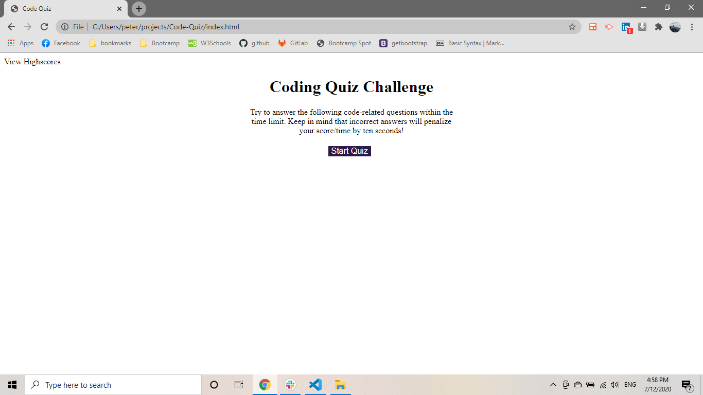
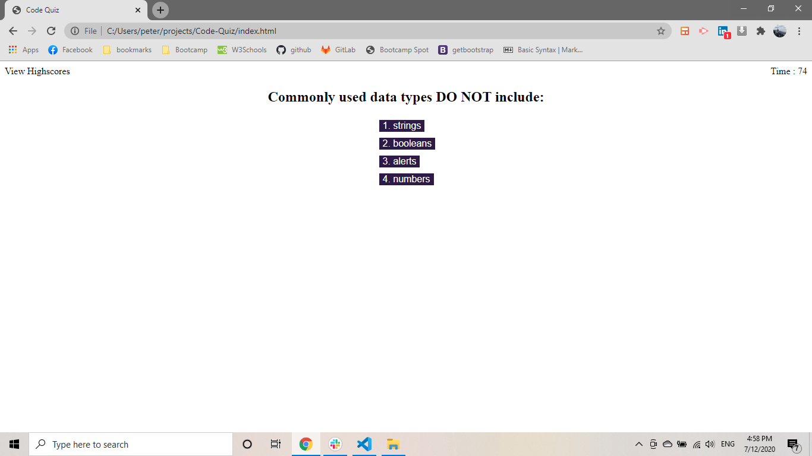
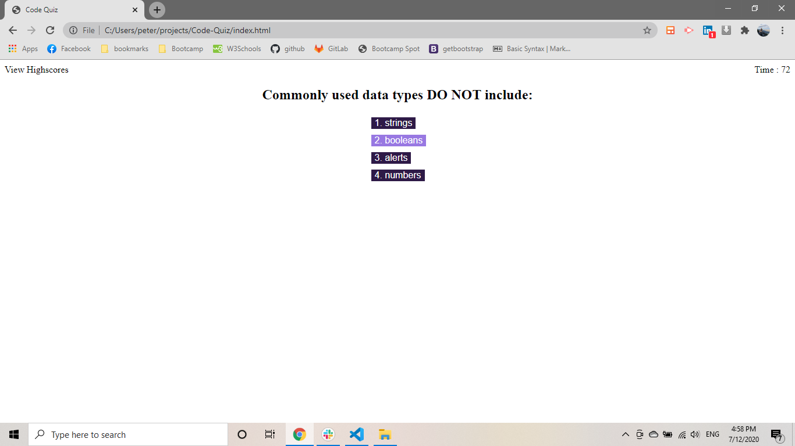
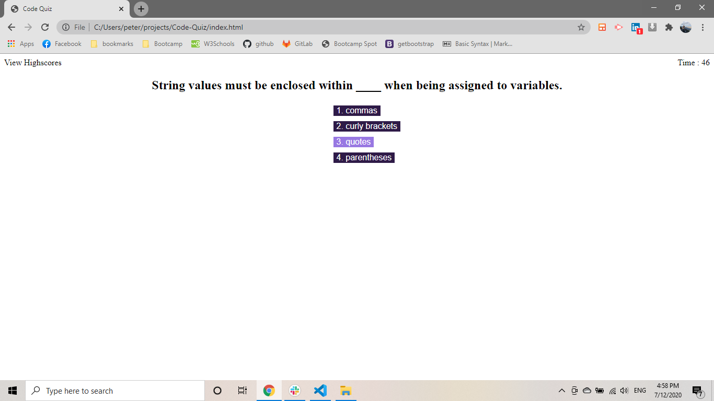
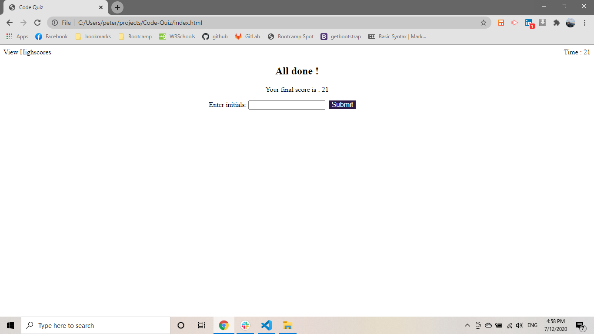
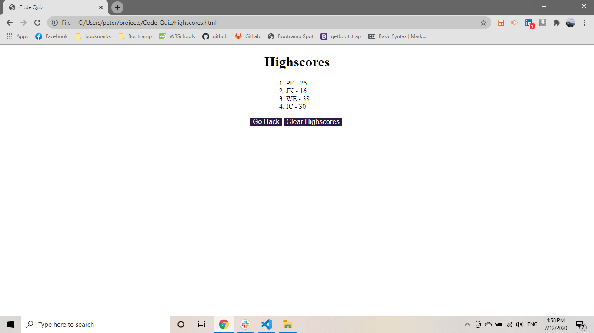

# Code-Quiz

link of repository :   https://github.com/pfotis/Code-Quiz.git

link of webpage    :    https://pfotis.github.io/Code-Quiz/

In this project there is a Code Quiz the funs for Javascript not only for them. As soon as the user click the button "Start Quiz" hte user will see at the up right of the screen the time 75 sec for all questions. Every wrong answer cost to user 10 seconds from the time. There is possibilty the user will finish the Quiz with negative time .

By the end od the Quiz the user has to type the initial , the user will at the Highscores page all the scores . At this page there is a button will clear the history of the all the scores.

### The following image is the first page the user will see .

### As soon as the user click the button "Start Quiz" will face the first question and the time .

### When the user start move the mouse he will see when the mouse will be over of any answer the answer will change colour.

### After all the questions and answer the user gave , the user will see the end the final score and he will insert his inital.

### Highscores this is the page all the scores saved .

